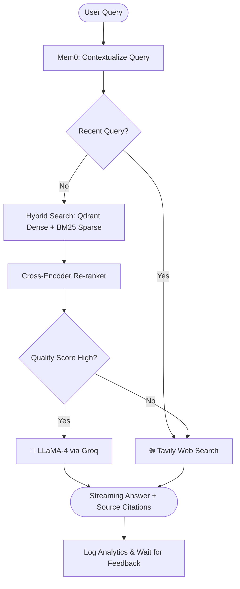

# ArivAI (RAG Chatbot)

**Live Demo:** [https://arivai.streamlit.app/](https://arivai.streamlit.app/)

A high-performance **Retrieval-Augmented Generation (RAG)** chatbot powered by **LLaMA-4 Scout** (via Groq), **Qdrant Cloud** vector search, and **Tavily** live web search — wrapped in a sleek, responsive **Streamlit** UI with real-time streaming and performance analytics.

---

## ✨ Key Features

- **📄 Hybrid Document Q&A:** Upload PDF, TXT, or DOCX files. Combines dense vector search (Qdrant) with sparse keyword search (BM25) for high recall.
- **🏆 Cross-Encoder Re-ranking:** Re-ranks initial search results using `ms-marco-MiniLM-L-6-v2` to ensure the most relevant context is fed to the LLM.
- **🤖 Streaming LLaMA-4 Responses:** Real-time token-by-token generation via Groq SSE for an instant, engaging user experience.
- **🌐 Intelligent Web Fallback:** Automatically detects if document context is insufficient and falls back to Tavily for live web search.
- **🧠 Persistent Memory:** Uses Mem0 to remember user preferences and past interactions across sessions.
- **📊 Real-time Analytics Dashboard:** Built-in tracking for latency, context quality, faithfulness, and user satisfaction (👍/👎 feedback).
- **🎨 Premium UI/UX:** Custom dark theme, glassmorphism components, page-level citations, and an expandable "View Sources" panel.

---

## 🏗️ Architecture



---

## 🚀 Quick Start (Local Setup)

### 1. Clone & Install

```bash
git clone https://github.com/<your-username>/llama4-rag-chatbot.git
cd llama4-rag-chatbot

# Create and activate virtual environment
python -m venv venv
# Windows
venv\Scripts\activate
# macOS/Linux
source venv/bin/activate

# Install dependencies
pip install -r requirements.txt
```

### 2. Configure Environment Variables

Create a `.env` file in the project root with your API keys and Qdrant credentials:

```env
# LLM & Search
GROQ_API_KEY=gsk_...
TAVILY_API_KEY=tvly-...

# Qdrant Cloud (Vector DB)
QDRANT_URL=https://<your-cluster>.qdrant.tech
QDRANT_API_KEY=your-qdrant-api-key
```

*Get your keys:*
- **Groq:** [console.groq.com](https://console.groq.com)
- **Tavily:** [app.tavily.com](https://app.tavily.com)
- **Qdrant:** [cloud.qdrant.io](https://cloud.qdrant.io)

### 3. Run the App

```bash
streamlit run streamlit_app.py
```
Open [http://localhost:8501](http://localhost:8501) in your browser.

---

## 📁 Project Structure

```text
llama4/
├── streamlit_app.py     # Main Streamlit UI, chat interface, and sidebar
├── document_utils.py    # Chunking, Qdrant integration, hybrid search, & re-ranking
├── llm_utils.py         # Groq LLM streaming & Tavily web fallback
├── analytics_utils.py   # Metrics tracking, faithfulness proxy, and feedback system
├── memory_utils.py      # Mem0 integration for long-term session memory
├── config.py            # Global configuration and tuning parameters
├── docs/                # Local document storage
├── requirements.txt     # Python dependencies
├── .env                 # Environment variables (do not commit!)
└── README.md            # Project documentation
```

---

## ☁️ Deployment

Ready to share? You can easily deploy this app using **Streamlit Community Cloud**:
1. Push this repository to GitHub.
2. Go to [share.streamlit.io](https://share.streamlit.io) and create a New App.
3. Point to `streamlit_app.py` in your repository.
4. Add your `.env` contents to the **Secrets** section in the Streamlit Cloud dashboard.
5. Click **Deploy**!

---

## 📄 License

MIT © 2025